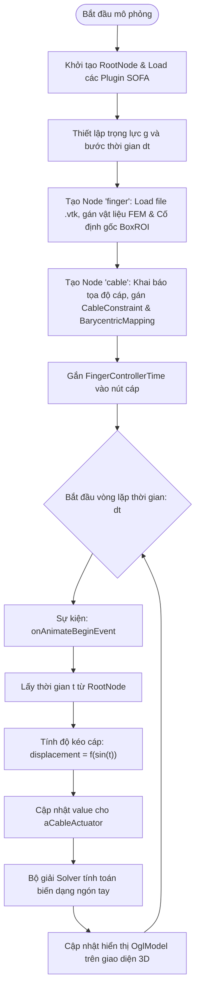

# SOFA-cable-controlled finger-Khuat-Hung-Anh
để sau
# Mô Phỏng Ngón Tay Robot Điều Khiển Bằng Dây (Cable-Controlled Finger)

## 1. Mục tiêu mô phỏng
Xây dựng mô hình mô phỏng chuyển động của ngón tay softrobot được điều khiển bằng cơ cấu dây kéo trong phần mềm SOFA framework.


## 2. Giới thiệu ngắn gọn về phần mềm
Dự án sử dụng:
- **SOFA Framework**: Nền tảng mô phỏng mã nguồn mở chuyên về cơ học vật thể biến dạng và tương tác thời gian thực.
- **SoftRobots Plugin**: Plugin mở rộng cho SOFA hỗ trợ mô phỏng các cấu trúc robot mềm và các bộ truyền động
  
  
## 3. Hình ảnh hoặc video kết quả


## 4. Phiên bản phần mềm và thư viện
- **Python**: 3.12.1
- **SOFA**: v26.06 
- **Plugin SOFA bắt buộc**:
  - `SoftRobots` (Plugin mô phỏng robot mềm và cơ cấu dây cáp)
  - `SofaPython3` (Plugin chạy Python 3 trong SOFA)
- **Thư viện phụ thuộc (Python & Module)**:
  - `Sofa.Core`, `Sofa.constants` (Thư viện Python có sẵn trong SofaPython3)
  - `os` (Thư viện chuẩn có sẵn của Python)
 

## 5. Hướng dẫn cài đặt
1. **Clone repository về máy:**
để sau

## 6. Lệnh chạy chương trình
1. Khởi động phần mềm **SOFA GUI** (hoặc gõ `runSofa` trong cửa sổ cmd).
2. Trên thanh menu, chọn **File** $\rightarrow$ **Open Simulation**.
3. Tìm và chọn file: Finger.py (hoặc Finger nếu máy không hiển thị đuôi file
4. Nhấn nút **Animate** (biểu tượng hình tam giác ở phía trên chính giữa màn hình) để bắt đầu tính toán mô phỏng.
   
<p align="center">
  
  <br>
  <em>Hình 1: Cách khởi động phần mềm qua file (có thể tạo shortcut trên desktop)</em>
</p>
<br><br>
<p align="center">
  
  <br>
  <em>Hình 2: Khởi động phần mềm qua cửa sổ cmd</em>
</p>
<br><br>
<p align="center">
  
  <br>
  <em>Hình 3: Cách chạy chương trình</em>
</p>

## 7. Cấu trúc Source Code

Dự án được tổ chức bao gồm các file cấu hình kịch bản mô phỏng, bộ điều khiển (Controller), và dữ liệu hình học/lưới (Mesh) như sau:

```text
├── mesh/
│   ├── finger.vtk              # File lưới phần tử hữu hạn (Tetrahedral Mesh) dùng cho FEM
│   └── finger.stl              # File bề mặt 3D dùng cho hiển thị giao diện (Visualization)
├── main_scene.py               # File chính tạo kịch bản mô phỏng (Scene Setup)
└── FingerControllerTime.py     # Bộ điều khiển co/duỗi cáp tự động theo thời gian
```
### main_scene.py:
- Chứa hàm createScene(rootNode) để xây dựng cây phân cấp SOFA (Scene Graph).

- Load các plugin SOFA cần thiết (SoftRobots, SofaPython3, các bộ giải Solver).

- Khởi tạo mô hình động lực học ngón tay mềm (FEM, vật liệu đàn hồi Elasticity, điều kiện biên cố định BoxROI).

- Thiết lập actuator cáp kéo (CableConstraint) và ánh xạ tọa độ (BarycentricMapping).

- Tích hợp bộ điều khiển FingerControllerTime vào nút cáp.

### FingerControllerTime.py:
- Lớp FingerControllerTime kế thừa từ Sofa.Core.Controller.

- Lắng nghe sự kiện theo bước thời gian mô phỏng (onAnimateBeginEvent).

- Tính toán và cập nhật giá trị độ co dãn của cáp (value) theo hàm sóng Sin biến thiên êm dịu.

### mesh:
- Lưu trữ các định dạng file hình học 3D phục vụ tính toán phần tử hữu hạn (.vtk) và hiển thị đồ họa (.stl).

## 8. Flowchart mô phỏng




