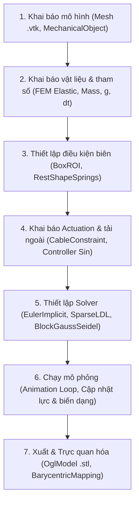

# SOFA-cable-controlled finger-Khuat-Hung-Anh
để sau
# Mô Phỏng Ngón Tay Robot Điều Khiển Bằng Dây (Cable-Controlled Finger)

## 1. Mục tiêu mô phỏng
Xây dựng mô hình mô phỏng chuyển động của ngón tay softrobot được điều khiển bằng cơ cấu dây kéo trong phần mềm SOFA framework.


## 2. Giới thiệu ngắn gọn về phần mềm
Dự án sử dụng:
- **SOFA Framework**: Nền tảng mô phỏng mã nguồn mở chuyên về cơ học vật thể biến dạng và tương tác thời gian thực.
- **SoftRobots Plugin**: Plugin mở rộng cho SOFA hỗ trợ mô phỏng các cấu trúc robot mềm và các bộ truyền động
  
  
## 3. Video kết quả

https://github.com/user-attachments/assets/37897040-7d10-462d-ba82-9568ce32247e
<p align="center">
    <em>Video mô phỏng quá trình co duỗi của ngón tay mềm</em>
</p>

## 4. Phiên bản phần mềm và thư viện
- **Python**: 3.12.1
- **SOFA**: v26.06 
- **Plugin SOFA bắt buộc**:
  - `SoftRobots` (Plugin mô phỏng robot mềm và cơ cấu dây cáp)
  - `SofaPython3` (Plugin chạy Python 3 trong SOFA)
- **Thư viện phụ thuộc (Python và Module)**:
  - `Sofa.Core`, `Sofa.constants` (Thư viện Python có sẵn trong SofaPython3)
  - `os` (Thư viện chuẩn có sẵn của Python)
 

## 5. Hướng dẫn cài đặt
1. **Clone repository về máy:**
để sau

## 6. Lệnh chạy chương trình
1. Khởi động phần mềm **SOFA GUI** (hoặc gõ `runSofa` trong cửa sổ cmd).
2. Trên thanh menu, chọn **File** $\rightarrow$ **Open Simulation** $\rightarrow$ **Finger.py**
3. Tìm và chọn file: Finger.py (hoặc Finger nếu máy không hiển thị đuôi file
4. Nhấn nút **Animate** (biểu tượng hình tam giác ở phía trên chính giữa màn hình) để bắt đầu tính toán mô phỏng.
   
<p align="center">
  
  <br>
  <em>Hình 1: Cách khởi động phần mềm qua file (có thể tạo shortcut trên desktop)</em>
</p>
<br><br>
<p align="center">
  
  <br>
  <em>Hình 2: Khởi động phần mềm qua cửa sổ cmd</em>
</p>
<br><br>
<p align="center">
  
  <br>
  <em>Hình 3: Cách chạy chương trình</em>
</p>

## 7. Cấu trúc Source Code (file source code: Finger.py và FingerControllerTime.py)

Dự án được tổ chức bao gồm các file cấu hình kịch bản mô phỏng, bộ điều khiển (Controller), và dữ liệu hình học/lưới (Mesh) như sau:

```text
├── mesh/
│   ├── finger.vtk              # File lưới phần tử hữu hạn (Tetrahedral Mesh) dùng cho FEM
│   └── finger.stl              # File bề mặt 3D dùng cho hiển thị giao diện (Visualization)
├── main_scene.py               # File chính tạo kịch bản mô phỏng (Scene Setup)
└── FingerControllerTime.py     # Bộ điều khiển co/duỗi cáp tự động theo thời gian
```
### main_scene.py:
- Chứa hàm createScene(rootNode) để xây dựng cây phân cấp SOFA (Scene Graph).

- Load các plugin SOFA cần thiết (SoftRobots, SofaPython3, các bộ giải Solver).

- Khởi tạo mô hình động lực học ngón tay mềm (FEM, vật liệu đàn hồi Elasticity, điều kiện biên cố định BoxROI).

- Thiết lập actuator cáp kéo (CableConstraint) và ánh xạ tọa độ (BarycentricMapping).

- Tích hợp bộ điều khiển FingerControllerTime vào nút cáp.

### FingerControllerTime.py:
- Lớp FingerControllerTime kế thừa từ Sofa.Core.Controller.

- Lắng nghe sự kiện theo bước thời gian mô phỏng (onAnimateBeginEvent).

- Tính toán và cập nhật giá trị độ co dãn của cáp (value) theo hàm sóng Sin biến thiên êm dịu.

### mesh: (đã có sẵn khi tải SOFA)
- Lưu trữ các định dạng file hình học 3D phục vụ tính toán phần tử hữu hạn (.vtk) và hiển thị đồ họa (.stl).

## 8. Flowchart mô phỏng


## 9. Các tham số chính

Dưới đây là bảng tổng hợp các tham số hệ thống trong chương trình mô phỏng

| Tham số | Dòng Code / Component | Giá trị mặc định | Đơn vị | Ý nghĩa / Vai trò |
| :--- | :--- | :--- | :--- | :--- |
| **`youngModulus`** | `TetrahedronFEMForceField` | **600** | kPa | **Độ cứng vật liệu ngón tay (Tham số khảo sát)** |
| `poissonRatio` | `TetrahedronFEMForceField` | 0.45 | - | Hệ số Poisson của vật liệu silicone/cao su |
| `totalMass` | `UniformMass` | 0.075 | kg | Tổng khối lượng của ngón tay mềm |
| `maxDisplacement`| `FingerControllerTime` | 25.0 | mm | Độ kéo cáp tối đa của Actuator |
| `gravity` | `rootNode.gravity` | [0, -9810, 0] | $\text{mm/s}^2$ | Gia tốc trọng trường theo hướng $-Y$ |
| `dt` | `rootNode.dt` | 0.01 | s | Bước thời gian tính toán mô phỏng |

---

## 10. Kết quả khảo sát tham số (Khảo sát Độ cứng $E$)

Khảo sát ảnh hưởng của **Độ cứng vật liệu (`youngModulus`)** đến khả năng biến dạng và góc uốn của ngón tay mềm khi giữ nguyên hành trình kéo cáp tối đa ($25\text{ mm}$).

Thực hiện chạy mô phỏng với các giá trị độ cứng khác nhau (`youngModulus`):

### Bảng kết quả khảo sát thực nghiệm

| STT | Giá trị Code (`youngModulus`) | Độ cứng quy đổi | Trạng thái vật liệu | Đặc điểm biến dạng quan sát được | Đánh giá mức độ uốn cong |
| :---: | :---: | :---: | :--- | :--- | :---: |
| **1** | **`150`** | $150\text{ kPa}$ | Rất mềm | Thân ngón tay uốn gập sâu nhất, các đốt uốn cong rõ rệt | **Rất lớn ($\approx 65^\circ$)** |
| **2** | **`300`** | $300\text{ kPa}$ | Mềm vừa | Ngón tay uốn cong vừa phải, duy trì được dạng hình học | **Trung bình ($\approx 40^\circ$)** |
| **3** | **`600`** | $600\text{ kPa}$ | Cứng | Ngón tay chỉ hơi uốn nhẹ, khả năng biến dạng cản trở nhiều | **Nhỏ ($\approx 15^\circ$)** |
| **4** | **`900 - 1000`** | $900 - 1000\text{ kPa}$ | Rất cứng | Hình dạng biến dạng gần như tương tự mức $600$, không có thêm sự khác biệt đáng kể | **Rất nhỏ / Tiệm cận bão hòa ($\approx 10^\circ$)** |
---

<<p align="center">
  <b>Kết quả mô phỏng độ cứng E (youngModulus)</b>
</p>

<table align="center">
  <tr>
    <td align="center" width="50%">
      <br>
      <b>(a) E = 150 kPa</b> (Rất mềm)
    </td>
    <td align="center" width="50%">
      <br>
      <b>(b) E = 300 kPa</b> (Mềm vừa)
    </td>
  </tr>
  <tr>
    <td align="center" width="50%">
      <br>
      <b>(c) E = 600 kPa</b> (Cứng)
    </td>
    <td align="center" width="50%">
      <br>
      <b>(d) E = 900–1000 kPa</b> (Rất cứng)
    </td>
  </tr>
</table>


## 11. Hạn chế của mô hình

Dù mô hình mô phỏng đã thể hiện đúng động học co/duỗi của ngón tay mềm bằng cáp kéo, hệ thống vẫn tồn tại một số hạn chế so với thực tế kỹ thuật:

1. **Giới hạn của mô hình vật liệu đàn hồi tuyến tính (Linear Elasticity):**
   * Trong code sử dụng `TetrahedronFEMForceField` dựa trên định luật Hooke ($\sigma = E \cdot \epsilon$). Mô hình này chỉ chính xác với biến dạng nhỏ. 
   * Trên thực tế, ngón tay mềm có thể được làm từ cao su/silicone trải qua biến dạng lớn và có tính chất **siêu đàn hồi**, đòi hỏi các mô hình phi tuyến tính để phản ánh đúng ứng suất thực tế.

2. **Bỏ qua ma sát và độ dãn của dây cáp:**
   * Thành phần `CableConstraint` giả định cáp chuyển động lý tưởng trong lòng ngón tay. 
   * Mô hình chưa tính đến **lực ma sát** giữa dây cáp và vách đường ống dẫn, cũng như **sự biến dạng đàn hồi** hay **độ biến dạng mỏi** dây cáp khi chịu tải trong thời gian dài

3. **Chưa tích hợp cơ chế tự va chạm (Self-Collision) và va chạm bên ngoài:**
   * Mô phỏng hiện tại chưa bổ sung các thành phần phát hiện va chạm, chưa thể mô phỏng cách ngón tay tương tác với các vật khác hoặc với mô người
   * Khi uốn gập sâu ở mức độ cứng thấp (`youngModulus = 150`), các vách đốt ngón tay có thể bị đâm xuyên qua nhau (Self-intersection) thay vì va chạm và chèn ép lẫn nhau như thực tế.

4. **Điều kiện biên cố định lý tưởng:**
   * Khâu cố định gốc ngón tay sử dụng `BoxROI` kết hợp `RestShapeSpringsForceField` với độ cứng lò xo lớn ($10^{12}$). Đây là giải pháp xấp xỉ toán học, chưa phản ánh đúng sự biến dạng cục bộ tại vị trí ngàm kẹp cơ khí ngoài thực tế.

5. **Chưa hiệu chuẩn tham số dập dao động (Damping Parameters):**
   * Các hệ số cản Rayleigh (`rayleighMass = 0.1`, `rayleighStiffness = 0.1`) được chọn theo kinh nghiệm mô phỏng, chưa qua thực nghiệm đo đạc thực tế để phản ánh đúng quán tính và độ suy giảm dao động của vật liệu silicone.


